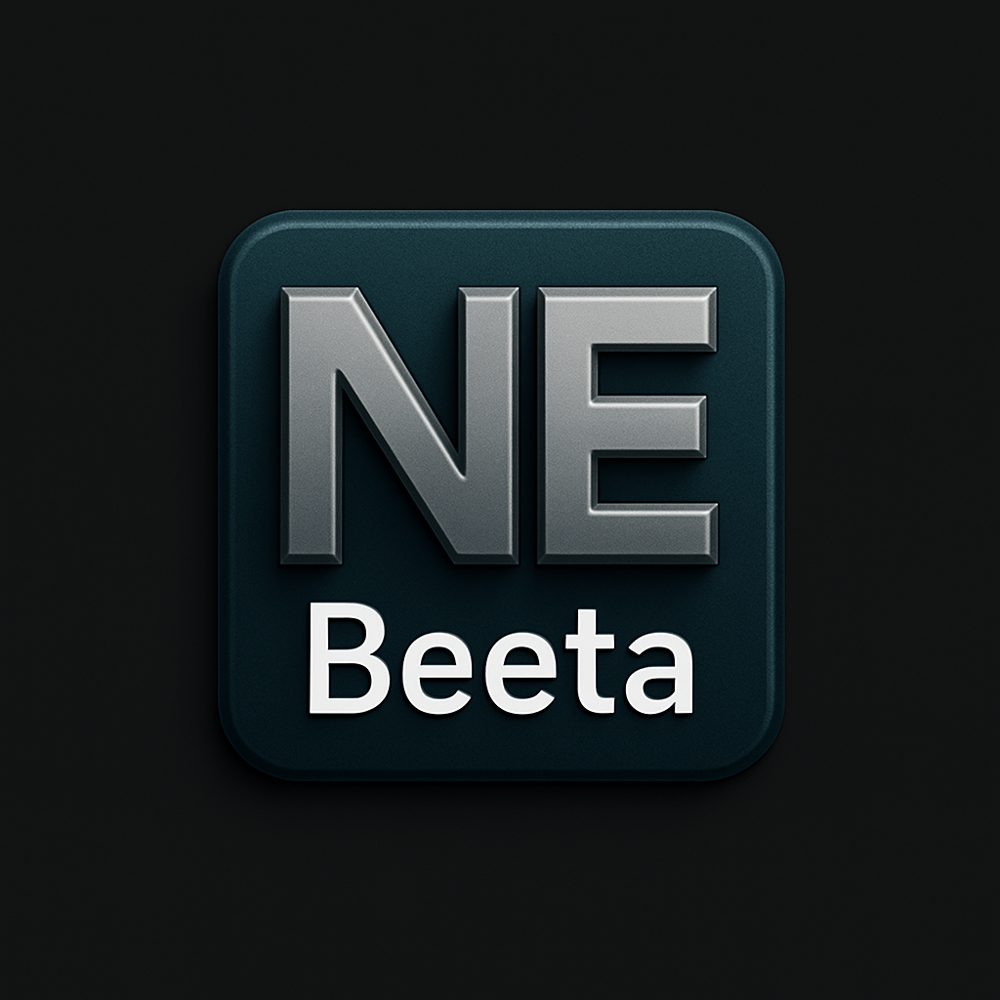

<div align="center">
  
  <h1>NbhEditor v4.4.0</h1>
  <p><b>A fast, modern, and AI-powered open-source text editor for Linux and Android.</b></p>
</div>

---

**NbhEditor** is built with performance, simplicity, and intelligent assistance in mind. Whether you are a casual user taking notes or a developer writing code, it combines a lightweight editing experience with powerful, opt-in AI tools to boost your productivity.

## ✨ What's New in v4.4.0

* 🔗 **Collaborative Session Auto-Save:** Sessions automatically save when you end or leave
* 📂 **Organized Home Screen:** Separate sections for regular files and collaborative sessions
* ☁️ **Drive Sync for Sessions:** Collaborative sessions sync across all your devices
* 🎯 **Smart Session Management:** Tap to open, long-press to delete saved sessions
* 🔄 **Cross-Device Sync:** Work on any device, your sessions follow you

See [CHANGELOG.md](CHANGELOG.md) for complete version history.

## 🚀 Core Features

* ⚡ **Fast & Lightweight:** Optimized for smooth performance, even on lower-end systems.
* ✨ **Modern Glass UI:** A clean, aesthetic interface that stays out of your way.
* 🌙 **Dynamic Theming:** Seamlessly switch between Dark and Light modes.
* ☁️ **Google Drive Sync:** Keep your files updated and accessible across all your devices.
* 🔗 **Real-Time Collaboration:** Work together with others in real-time collaborative sessions.
* 💾 **Session Management:** Auto-save and sync collaborative sessions across devices.
* 🧩 **Plugin Ready (WIP):** Extensible architecture for future community plugins and add-ons.

## 🧠 AI-Powered Assistance

NbhEditor includes a suite of optional AI capabilities to help you work smarter. *(Note: AI features can be completely disabled for offline or privacy-focused use. Depending on your build, some features may require an external API key.)*

* **Smart Suggestions:** Intelligent code and text assistance.
* **Memory System:** Context-aware AI conversations that remember your project details.
* **Voice Mode:** Hands-free interaction with the AI using voice commands.
* **Media Capabilities:** Built-in tools for image generation and video analysis directly within the editor.

## 📱 Supported Platforms

* **Linux:** AMD64 / ARM64
* **Android:** ARM64

## 📥 Download

> ⚠️ *Download links are updated with each stable release.*

* Linux AMD64 – [Download Link](#)
* Linux ARM64 – [Download Link](#)
* Android APK – [Download Link](#)

## 📸 Screenshots


*(Caption: NbhEditor in action)*

## 📦 Installation (Linux)

Getting started on Linux is quick and easy. Open your terminal and run the following commands:

```bash
# Extract the downloaded archive
tar -xvf NbhEditor.tar.xz

# Navigate into the extracted directory
cd NbhEditor

# Make the startup script executable (if necessary)
chmod +x nbheditorstart.sh

# Run the editor
./nbheditorstart.sh

## License & Copyright

​Copyright © 2023-2026 Beeta Technologies Inc.

​This project is free software: you can redistribute it and/or modify it under the terms of the GNU General Public License v3.0 (GPL-3.0) as published by the Free Software Foundation.